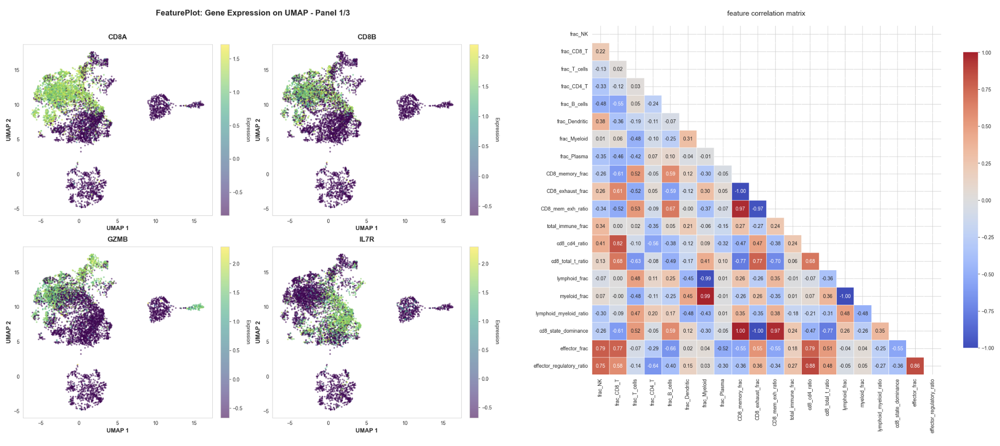

# Immune Response Prediction in Melanoma  
### *Cross-Modality Machine Learning Using Single-Cell and Bulk RNA-seq datasets*



This repository contains the full workflow for predicting melanoma immunotherapy response using **single-cell RNA-seq**, **bulk RNA-seq**, and **transfer learning**.  
We integrate three datasets (Sade-Feldman scRNA-seq, Hugo bulk, Riaz bulk) and build classical + deep learning models to quantify patient-level immune activation signatures.

---

# Repository Structure

```
02718_Computational_Medicine_Project/
│
├── models/
│   ├── feature_engineering_analysis_pre.ipynb     # scRNA feature engineering
│   ├── patient_comp_predictions.ipynb             # Immune composition models
│   ├── transfer_learning.ipynb                    # Bulk → single-cell transfer learning
│
├── preprocessing/
│   ├── datapeek.ipynb                             # Metadata + raw matrix inspection
│   ├── filtering_and_visualization.ipynb          # QC, normalization, PCA/UMAP
│   ├── get_patient_cell_composition.ipynb         # Per-patient immune cell features
│
├── Computational_Medicine_Final_Report.pdf        # Final project report
├── README.md
└── .gitignore
```

### Note: Where the `data/` folder must live

All notebooks expect a folder structured like:

```
data/
│
├── GSE120575/          # Sade-Feldman scRNA-seq
├── GSE78220/           # Hugo bulk
├── GSE91061/           # Riaz bulk
└── processed_datasets/ # Saved harmonized matrices
```

Place `data/` **next to** `models/` and `preprocessing/` (not inside them).

---

# Requirements

Install all dependencies:

```bash
pip install scanpy anndata geoparse mygene xgboost seaborn scikit-learn pandas numpy matplotlib
```

Works in Google Colab or any Python ≥ 3.9 environment.

---

# Workflow Overview

## 1️⃣ Preprocessing (Folder: preprocessing/)

### `datapeek.ipynb`
- Inspect raw metadata and expression matrices  
- Validate sample IDs and structure  

### `filtering_and_visualization.ipynb`
- QC filtering (n_genes, total counts, MT%)  
- Normalization & log1p  
- HVGs, PCA, UMAP, Harmony batch correction  
- Marker visualization  

### `get_patient_cell_composition.ipynb`
- Compute per-patient immune cell proportions  
- CD8 T-cell states (memory/exhausted)  
- Shannon diversity, heterogeneity  
- Saves intermediate CSV files used downstream  

---

## 2️⃣ Modeling (Folder: models/)

### **A. `patient_comp_predictions.ipynb`**
Baseline models using **immune cell composition**:
- Logistic Regression, Random Forest, XGBoost  
- Evaluates accuracy, recall, ROC–AUC   

---

### **B. `feature_engineering_analysis_pre.ipynb`**
Expanded feature engineering:
- Cell-type ratios  
- CD8 memory/exhaustion fractions  
- Gene expression summary statistics (mean, sd, max)  
- Shannon entropy  
- Interaction features  

**Outcome:**  
Feature engineering boosts LR accuracy (0.68→0.88) and recall (0.6→0.9), and improves XGBoost performance with a more compact feature set.

---

### **C. `transfer_learning.ipynb`**
Bulk → single-cell transfer learning workflow:

1. Load Hugo + Riaz bulk RNA-seq  
2. Convert Sade-Feldman scRNA-seq to **pseudo-bulk**  
3. Harmonize gene symbols  
4. Train on bulk, test on scRNA  
5. Evaluate 18-gene immunotherapy signature  
6. Build MLP + XGBoost **independent-scaling ensemble**  
7. Biological interpretation via gene importances  

**Key result:**  
Review the attached report.

---

# Processed Datasets and "How To Run?"

**Processed Data Folder (Box):**  
https://cmu.box.com/s/zk3zeuhr4baunkis9ig5kufau7euqggm

Place all downloaded files inside:

```
data/
├── melanoma_scRNA_processed.h5ad
├── patient_celltype_composition.csv
├── pre_patient_celltype_composition.csv
├── post_patient_celltype_composition.csv
└── transfer_learning_processed_datasets/
      ├── X_train_bulk_harmonized.csv
      ├── y_train_bulk_labels.csv
      ├── X_test_sade_pseudobulk.csv
      ├── y_test_sade_labels.csv
      ├── X_train_bulk_signature18.csv
      └── X_test_sade_signature18.csv
```

This section explains **which notebook requires which file**, so you can run everything smoothly.

---

# Notebook-by-Notebook Data Requirements

## 1️⃣ `preprocessing/datapeek.ipynb`
**Uses:**  
- `melanoma_scRNA_processed.h5ad` (optional; raw version also works)  

**Purpose:**  
Inspect metadata, structure, and cell/gene counts.  
Runs with either raw h5 or processed h5ad.

---

## 2️⃣ `preprocessing/filtering_and_visualization.ipynb`
**Uses:**  
- `melanoma_scRNA_processed.h5ad`  

**Purpose:**  
Quality control (n_genes, counts, MT%), normalization, PCA, UMAP, Harmony.  
Also used to regenerate figures for the report.

---

## 3️⃣ `preprocessing/get_patient_cell_composition.ipynb`
**Uses:**  
- `melanoma_scRNA_processed.h5ad`  

**Outputs:**  
- `patient_celltype_composition.csv`  
- `pre_patient_celltype_composition.csv`  
- `post_patient_celltype_composition.csv`

These CSVs are required for downstream modeling.

---

## 4️⃣ `models/patient_comp_predictions.ipynb`
**Requires:**  
- `pre_patient_celltype_composition.csv` (for pre-treatment models)  
- `patient_celltype_composition.csv` (for combined models)

**Purpose:**  
Generates baseline ML predictions using immune cell type fractions only.

---

## 5️⃣ `models/feature_engineering_analysis_pre.ipynb`
**Requires:**  
- `patient_celltype_composition.csv`  
- `melanoma_scRNA_processed.h5ad` (for gene statistics per cell type)

**Purpose:**  
Builds engineered features:  
- ratios  
- CD8 memory/exhaustion fractions  
- gene summary statistics  
- Shannon diversity  
- interaction features  

Produces the 11 → 146 feature set used in the paper.

---

## 6️⃣ `models/transfer_learning.ipynb`
**Optional:** *all transfer learning matrices:*

**Note:** This notebook contains cells that download data from the internet directly and hence the following files are not required. **transfer_learning.ipynb** is self-contained.

Location: `data/transfer_learning_processed_datasets/`

Files:
- `X_train_bulk_harmonized.csv`  
- `y_train_bulk_labels.csv`  
- `X_test_sade_pseudobulk.csv`  
- `y_test_sade_labels.csv`  
- `X_train_bulk_signature18.csv`  
- `X_test_sade_signature18.csv`

**Purpose:**  
- Harmonize Hugo + Riaz bulk RNA-seq  
- Train bulk-domain MLP/XGBoost models  
- Evaluate transfer to Sade-Feldman pseudo-bulk  
- Generate ROC, confusion matrix, feature attribution plots  

**If you wish to run using the above files and not rely on internet downloads for running transer_learning.ipynb:**
Download or generate using `transfer_learning.ipynb`, then place into:

```
data/processed_datasets/
```

Files:
```
X_train_bulk_harmonized.csv
y_train_bulk_labels.csv
X_test_sade_pseudobulk.csv
y_test_sade_labels.csv
X_train_bulk_signature18.csv
X_test_sade_signature18.csv
```

### Load them in one cell:

```python
import pandas as pd

DATA = "data/processed_datasets"

X_train = pd.read_csv(f"{DATA}/X_train_bulk_harmonized.csv", index_col=0)
y_train = pd.read_csv(f"{DATA}/y_train_bulk_labels.csv", index_col=0).iloc[:,0]

X_test = pd.read_csv(f"{DATA}/X_test_sade_pseudobulk.csv", index_col=0)
y_test = pd.read_csv(f"{DATA}/y_test_sade_labels.csv", index_col=0).iloc[:,0]

print(X_train.shape, X_test.shape)
```


# ⚡ Quick Start: Run the Transfer-Learning Ensemble

```python
from sklearn.preprocessing import StandardScaler
from sklearn.ensemble import VotingClassifier
from sklearn.neural_network import MLPClassifier
from xgboost import XGBClassifier
from sklearn.metrics import roc_auc_score
import numpy as np

signature = [
    'CD8A','CD8B','GZMA','GZMB','PRF1','IFNG','CXCL9','CXCL10',
    'STAT1','HLA-DRA','PDCD1','CD274','CTLA4','LAG3','TIGIT',
    'HAVCR2','IDO1','TBX21'
]

Xtr = np.log1p(X_train[signature])
Xte = np.log1p(X_test[signature])

sc1, sc2 = StandardScaler(), StandardScaler()
Xtr_s = sc1.fit_transform(Xtr)
Xte_s = sc2.fit_transform(Xte)

mlp = MLPClassifier(hidden_layer_sizes=(16,), alpha=0.01, max_iter=1000)
xgb = XGBClassifier(eval_metric='logloss', max_depth=2, learning_rate=0.05, n_estimators=100)

ens = VotingClassifier(
    estimators=[('mlp', mlp), ('xgb', xgb)],
    voting='soft', weights=[2,1]
).fit(Xtr_s, y_train)

auc = roc_auc_score(y_test, ens.predict_proba(Xte_s)[:,1])
print("Bulk → Single-Cell Transfer AUC:", auc)
```


---
# Dataset References:
@misc{GSE120575,
  author       = {Sade-Feldman, Moshe and Yizhak, Keren},
  title        = {Defining T cell states associated with response to checkpoint immunotherapy in melanoma},
  year         = {2018},
  howpublished = {\url{https://www.ncbi.nlm.nih.gov/geo/query/acc.cgi?acc=GSE120575}},
  note         = {GEO Series GSE120575. Single-cell RNA-seq of melanoma tumors treated with checkpoint inhibitors. dbGaP accession: phs001680.v1.p1},
  publisher    = {NCBI Gene Expression Omnibus}
}
@misc{GSE78220,
  author       = {Hugo, Willy and Zaretsky, Jesse M. and Sun, Lihua and Song, Chang S. and Moreno, Belen H. and Hu-Lieskovan, Stephanie and Berent-Maoz, Beata and Pang, J. Michelle and Chmielowski, Bartosz and Cherry, Gordon and Seja, Erica and Lomeli, Shirley and Kong, Xiaoyan and Kelley, Matthew C. and Sosman, Jeffrey A. and Johnson, Douglas B. and Ribas, Antoni},
  title        = {Genomic and transcriptomic features of response to anti-PD-1 therapy in metastatic melanoma},
  year         = {2016},
  howpublished = {\url{https://www.ncbi.nlm.nih.gov/geo/query/acc.cgi?acc=GSE78220}},
  note         = {GEO Series GSE78220. Processed RNA-seq data (FPKM) used in checkpoint immunotherapy response studies},
  publisher    = {NCBI Gene Expression Omnibus}
}
@misc{GSE91061,
  author       = {Riaz, Nadeem and Havel, Jonathan J. and Kendall, Sarah M. and Makarov, Vladimir and Walsh, Lisa A. and Desrichard, Alexis and Weinhold, Nils and Chan, Timothy A.},
  title        = {Tumor and microenvironment evolution during immunotherapy with nivolumab},
  year         = {2017},
  howpublished = {\url{https://www.ncbi.nlm.nih.gov/geo/query/acc.cgi?acc=GSE91061}},
  note         = {GEO Series GSE91061. RNA-seq data (FPKM) from melanoma patients treated with anti-PD-1 therapy},
  publisher    = {NCBI Gene Expression Omnibus}
}
---

# Final Notes

- If the directory structure matches the layout above, **all notebooks will run without any path edits**.  
- Keeping processed datasets separate from raw data ensures your repo remains lightweight.  
- You may optionally upload only the `.csv` files and omit the `.h5ad` to GitHub due to size limits.


# Acknowledgments
This work was completed as part of **02718 / 02718 Computational Medicine** at **Carnegie Mellon University (CMU)**.

